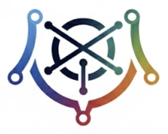

<div align="center">
  
  
</div>

**Clarion** — Intelligent Policy Orchestration Platform for Heterogeneous Network Environments

> **Transform network security policy from manual, error-prone configuration into intelligent, data-driven orchestration across your entire infrastructure.**

[](https://www.python.org/downloads/)
[](https://opensource.org/licenses/MIT)
[]()

---

## 🎯 The Challenge: Policy Management at Scale

Modern networks span **campus, branch, WAN, cloud, and data centers** with **multiple vendors** (Cisco, Aruba, Juniper, Palo Alto, Fortinet) and **diverse enforcement methods** (SGTs, ACLs, firewall rules, cloud security groups, server agents). 

**Traditional policy management is broken:**
- ❌ Manual classification is slow, error-prone, and doesn't scale
- ❌ Policy conflicts across vendors and environments
- ❌ No visibility into actual traffic patterns vs. intended policy
- ❌ Reactive security: policies lag behind network changes
- ❌ Fragmented view: can't see policy across the entire infrastructure

**Clarion solves this by leveraging network visibility and identity context to automatically discover, generate, and deploy policy across heterogeneous environments.**

---

## ✨ What Makes Clarion Different?

### 🧠 **Intelligent Discovery**
Clarion uses **machine learning** to automatically discover endpoint behavior patterns from network flows. No manual classification required—the system learns what devices actually do, not what you think they should do.

### 🌐 **Multi-Vendor, Multi-Environment**
Clarion orchestrates policy across:
- **Network Vendors**: Cisco TrustSec, Aruba ClearPass, Juniper, Palo Alto, Fortinet
- **Environments**: Campus, Branch, WAN, Cloud (AWS, Azure, GCP), Data Centers
- **Enforcement Methods**: SGTs, ACLs, firewall rules, cloud security groups, server agents

### 🔗 **Complete Network Topology**
Build a comprehensive graph of your network infrastructure—switches, routers, firewalls, and their connections. Enable **attack path mapping**, **blast radius analysis**, and **policy gap detection** across your entire environment.

### 📊 **Data-Driven Policy Generation**
Generate policies based on **observed traffic patterns**, not assumptions. See exactly what would be denied if you change a "Permit" to "Deny" with automated impact analysis.

### 🎯 **Identity-Aware Segmentation**
Correlate network flows with identity data to build **high-fidelity identity context** for accurate policy recommendations.

### 🚀 **Scale-First Architecture**
**Edge processing** compresses flows to behavioral sketches on-switch, eliminating central bottlenecks. Handle enterprise-scale traffic with **O(endpoints) memory**, not O(flows).

### 🤖 **AI-Enhanced Intelligence** (Optional)
Optional AI/LLM integration provides:
- **Conversational AI interface** for natural language policy queries
- **Intelligent SGT taxonomy design** from business context
- **Anomaly detection** for zero-trust continuous verification
- **Policy justification** with human-readable explanations

---

## 🏗️ Architecture

Clarion uses a **distributed, scale-first architecture** that processes data at the edge. Cisco Example:

```
┌─────────────────────────────────────────────────────────────────────────────┐
│                              EDGE TIER (Per-Switch)                          │
│                         Catalyst 9K App Hosting Container                     │
│                                                                               │
│   Flows ──▶ Aggregate ──▶ Build Sketches ──▶ Local Cluster ──▶ Sync         │
│                                                                              │
└─────────────────────────────────────────────────────────────────────────────┘
                                        │
                          Behavioral Sketches (KB, not GB)
                                        ▼
┌─────────────────────────────────────────────────────────────────────────────┐
│                              BACKEND TIER                                    │
│                                                                              │
│   Merge Sketches ──▶ HDBSCAN Clustering ──▶ Semantic Labels ──▶ Policy Gen  │
│                                                                              │
│   Identity Correlation ──▶ Topology Graph ──▶ Attack Path Mapping         │
│                                                                              │
│   Policy Matrix ──▶ Multi-Vendor Translation ──▶ Deployment Orchestration │
└─────────────────────────────────────────────────────────────────────────────┘
```

### Why This Architecture?

| Traditional Approach | Clarion Approach |
|---------------------|------------------|
| Ship all flows to central collector | Compress to sketches at edge |
| O(flows) memory growth | O(endpoints) memory — bounded |
| Central processing bottleneck | Horizontally distributed |
| Batch clustering overnight | Incremental real-time updates |
| Single-vendor focus | Multi-vendor orchestration |
| Manual policy configuration | Automated policy generation |

---

## 🧠 How It Works

### 1. **Multi-Source Data Ingestion**
Gather data from across your infrastructure:
- **NetFlow/IPFIX/sFlow** from network devices
- **ISE pxGrid** for identity and session data
- **Active Directory** for user/group context
- **Cloud platforms** (AWS, Azure, GCP) for cloud flow logs and security groups
- **IoT platforms** (Medigate, ClearPass) for device classification
- **Network topology** via SNMP, APIs, and configuration parsing

### 2. **Behavioral Discovery**
Each endpoint gets a lightweight behavioral fingerprint:

```python
@dataclass
class EndpointSketch:
    endpoint_id: str              # MAC address
    
    # Cardinality (HyperLogLog)
    unique_peers: HyperLogLog     # How many IPs contacted
    unique_services: HyperLogLog  # How many services accessed
    
    # Frequency (Count-Min Sketch)
    port_frequency: CountMinSketch    # Port usage distribution
    service_frequency: CountMinSketch # Service access patterns
    
    # Aggregates
    bytes_in: int
    bytes_out: int
    in_out_ratio: float           # Client vs server
    active_hours: int             # Activity pattern bitmap
```

### 3. **Intelligent Clustering**
HDBSCAN finds natural groupings based on behavior:

```
Cluster-0: [laptop-1, laptop-2, ...] → "Corporate Users"
Cluster-1: [server-1, server-2, ...] → "Servers"  
Cluster-2: [printer-1, printer-2, ...] → "Printers"
Cluster-3: [camera-1, sensor-1, ...] → "IoT Devices"
```

### 4. **Identity Correlation**
Correlate network flows with identity data for high-fidelity context:
- **User → Device → IP** mapping from ISE pxGrid
- **AD group memberships** for user context
- **Device attributes** from multiple sources
- **Confidence scoring** for identity assignments

### 5. **Policy Generation**
Generate policies based on observed traffic patterns:

**TrustSec (Current):**
```
! SGT 2 (Corp-Users) → SGT 10 (Servers)
permit tcp dst eq 443
permit tcp dst eq 22
deny ip log
```

**Multi-Vendor (Planned):**
- **ACLs** for traditional routers/switches
- **Firewall rules** for Palo Alto, Fortinet, Check Point
- **Cloud security groups** for AWS, Azure, GCP
- **Server agents** for host-based enforcement

### 6. **Network Topology & Attack Path Mapping**
Build a complete graph of your network:
- **Device connections** (switches, routers, firewalls)
- **Attack path visualization** (trace potential attack paths)
- **Blast radius analysis** (what can be reached from compromised device/SGT)
- **Policy gap detection** (identify paths without policy enforcement)

### 7. **Deployment Orchestration**
Deploy policies across your infrastructure:
- **Automated deployment** via vendor APIs (ISE ERS, firewall APIs, cloud APIs)
- **Multi-vendor coordination** (ensure policies are consistent)
- **Policy conflict detection** (identify conflicting policies)
- **Impact analysis** (show exactly what would be denied)

---

## 🎯 Key Capabilities

### ✅ **Currently Implemented (MVP)**
- ✅ **Behavioral Clustering** — Unsupervised learning to discover endpoint groups
- ✅ **Incremental Clustering** — Fast assignment of new endpoints to existing clusters
- ✅ **SGT Lifecycle Management** — Stable SGT registry with dynamic membership
- ✅ **Confidence Scoring** — Consistent confidence scores for all decisions
- ✅ **Policy Generation** — Automated SGT and SGACL generation for TrustSec
- ✅ **ISE Integration** — Brownfield support, policy deployment via ERS API
- ✅ **Network Topology** — Location hierarchy, subnets, switches
- ✅ **User Management** — User database, clustering, SGT assignments
- ✅ **Edge Processing** — On-switch sketch building and clustering
- ✅ **NetFlow Collection** — v5, v9, IPFIX with SGT extraction
- ✅ **React Frontend** — Production-ready UI for visualization and management

### 🚧 **In Active Development**
- 🚧 **Multi-Vendor Connectors** — Aruba, Juniper, Palo Alto, Fortinet
- 🚧 **Cloud Platform Integration** — AWS, Azure, GCP flow logs and security groups
- 🚧 **Network Topology Graph** — Complete device connection graph with attack path mapping
- 🚧 **Device Discovery** — SNMP, API, and configuration-based topology discovery
- 🚧 **Advanced AD Integration** — WEF/WEC for near-real-time identity correlation
- 🚧 **AI Integration** — Conversational AI, intelligent recommendations, anomaly detection
- 🚧 **PostgreSQL/TimescaleDB** — Production-scale time-series database
- 🚧 **Neo4j Graph Database** — Relationship storage and graph-based analysis

---

## 📊 Use Cases

### 1. **Greenfield Segmentation**
Start with zero-trust segmentation from day one. Clarion discovers endpoint behavior, recommends SGTs, and generates policies automatically.

### 2. **Brownfield Optimization**
Sync existing ISE configuration, identify over-privileged SGTs, and recommend policy tightening based on observed traffic.

### 3. **Multi-Environment Policy Orchestration**
Generate and deploy consistent policies across campus, branch, WAN, cloud, and data centers—regardless of vendor.

### 4. **Attack Path Analysis**
Visualize potential attack paths through your network infrastructure and identify policy gaps.

### 5. **Zero Trust Continuous Verification**
Detect behavioral anomalies and automatically trigger security responses (SGT quarantining).

### 6. **Policy Impact Analysis**
See exactly which users or devices would be denied if you change a "Permit" to "Deny" before deploying.

---

## 📁 Project Structure

```
clarion/
├── docs/                        # Comprehensive documentation
│   ├── DESIGN.md               # System architecture
│   ├── AI_ENHANCED_ARCHITECTURE.md  # AI integration design
│   ├── ISE_INTEGRATION.md      # ISE integration guide
│   └── ...
│
├── src/clarion/                 # Backend library
│   ├── sketches/               # HyperLogLog, Count-Min Sketch
│   ├── clustering/             # HDBSCAN, incremental clustering, SGT lifecycle
│   ├── integration/            # ISE pxGrid, AD, connectors
│   ├── policy/                 # Policy generation, multi-vendor translation
│   ├── topology/               # Network topology, device discovery
│   └── api/                    # FastAPI REST API
│
├── edge/                       # Edge container (Catalyst 9K)
│   └── clarion_edge/          # Lightweight edge processing
│
├── collector/                  # Flow collector (NetFlow/IPFIX/sFlow)
│   └── clarion_collector/     # Collector implementation
│
├── frontend/                   # React frontend (production UI)
│   └── src/                   # React components and pages
│
└── tests/                      # Test suite
```

---

## 🔧 Technology Stack

| Component | Technology |
|-----------|------------|
| **Language** | Python 3.11+ |
| **Sketches** | datasketch (HyperLogLog, CMS) |
| **Clustering** | scikit-learn, hdbscan |
| **API** | FastAPI |
| **Database** | SQLite (dev) → PostgreSQL + TimescaleDB (prod) |
| **Graph DB** | Neo4j (relationships, topology, attack paths) |
| **Frontend** | React + TypeScript + Tailwind CSS |
| **Edge Container** | Alpine Linux + Python |
| **NetFlow** | v5, v9, IPFIX, sFlow |
| **Identity** | ISE pxGrid, AD LDAP, Cloud IAM |
| **AI** | Ollama (local), OpenAI, Anthropic, Google (cloud) |

---

## 📖 Documentation

### Core Documentation
- **[Quick Start Guide](QUICK_START.md)** — Complete system setup
- **[Capabilities Roadmap](CAPABILITIES_ROADMAP.md)** — Complete feature inventory
- **[Prioritized Roadmap](PRIORITIZED_ROADMAP.md)** — Development priorities and timeline

### Architecture & Integration
- **[Design Document](docs/DESIGN.md)** — System architecture and data model
- **[AI-Enhanced Architecture](docs/AI_ENHANCED_ARCHITECTURE.md)** — AI integration design
- **[ISE Integration](docs/ISE_INTEGRATION.md)** — Cisco ISE integration guide
- **[Data Architecture](docs/DATA_ARCHITECTURE.md)** — Data sources and correlation
- **[Topology Architecture](docs/TOPOLOGY_ARCHITECTURE.md)** — Network topology design

### Components
- **[Frontend README](frontend/README.md)** — Frontend setup and development
- **[Collector README](collector/README.md)** — Flow collector setup
- **[CML Lab Setup](lab/CML_LAB_SETUP.md)** — Cisco CML lab setup guide
- **[ISE Configuration](lab/ISE_CONFIGURATION.md)** — Complete ISE configuration guide

---

## 🗺️ Roadmap

### ✅ **Phase 1: Foundation (Complete)**
- Core data structures (sketches, clustering)
- Policy generation for TrustSec
- Edge processing
- React frontend
- ISE integration (brownfield support)

### 🚧 **Phase 2: Multi-Vendor & Scale (In Progress)**
- PostgreSQL/TimescaleDB migration
- Neo4j graph database integration
- Network topology graph and attack path mapping
- Device discovery (SNMP, API, configuration)
- Multi-vendor connector framework

### 📋 **Phase 3: Advanced Features (Planned)**
- Cloud platform connectors (AWS, Azure, GCP)
- Additional network vendor connectors (Aruba, Juniper, Palo Alto, Fortinet)
- AI integration (conversational AI, intelligent recommendations)
- Behavioral anomaly detection
- Advanced AD integration (WEF/WEC)

### 🔮 **Phase 4: Production Readiness (Planned)**
- Authentication & authorization
- Security hardening
- High availability
- Comprehensive monitoring
- CI/CD pipeline

**See [PRIORITIZED_ROADMAP.md](PRIORITIZED_ROADMAP.md) for detailed timeline and priorities.**

---

## 💡 Why Clarion?

### **For Network Engineers**
- **Automate policy generation** from observed traffic patterns
- **See policy impact** before deploying changes
- **Orchestrate policy** across multiple vendors and environments
- **Identify policy gaps** and over-privileged segments

### **For Security Teams**
- **Zero-trust segmentation** with continuous verification
- **Attack path visualization** and blast radius analysis
- **Behavioral anomaly detection** for threat detection
- **Policy compliance** across heterogeneous environments

### **For IT Operations**
- **Reduce manual configuration** errors
- **Scale policy management** to enterprise networks
- **Unified view** of policy across campus, branch, cloud, and DC
- **Automated deployment** reduces deployment time

---

## 🤝 Contributing

We welcome contributions! Please see our contributing guidelines and code of conduct.

---

## 📄 License

MIT License - see [LICENSE](LICENSE) for details.

---

## 🙏 Acknowledgments

- Cisco TrustSec documentation and pxGrid APIs
- Network security community for inspiration and feedback
- datasketch library for probabilistic data structures
- Open source community for amazing tools and libraries

---

<div align="center">
  <strong>Transform your network security policy management with intelligent orchestration.</strong>
</div>
